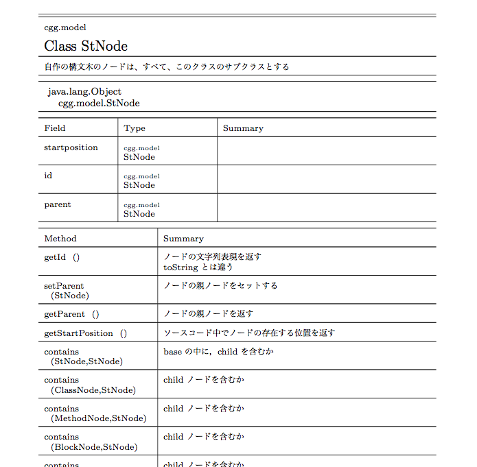

jdoc2tex
===
javadocをTeX形式で出力する為のカスタムDoclet

コンパイル
--
build.xmlのあるディレクトリでantコマンドを実行して下さい．

``` 
ant

``` 
※内部でjavadoc関連の機能を使うので，tools.jarが必要です．  
環境によっては，tools.jarをjdoc2tex/lib/にコピる必要があります．


使い方
--
普通のカスタムDocletのように使えます．  

```
java -classpath .:tools.jar -doclet Jdoc2Tex -docletpath jdoc2tex.jar -sourcepath src -subpackages targetpackage
```

また，また， {@link Jdoc2Tex} クラスは，mainメソッドを持つため，以下のようにも使えます．

```
java -classpath .:tools.jar:jdoc2tex.jar Jdoc2Tex -sourcepath src -subpackages targetpackage
```
実行するとout/javadoc.texとout/javadoc/が作成されます．  
基本的にはjavadoc.tex単体でタイプセット可能です．


スクリーンショット
--


らいせんす  
MIT
